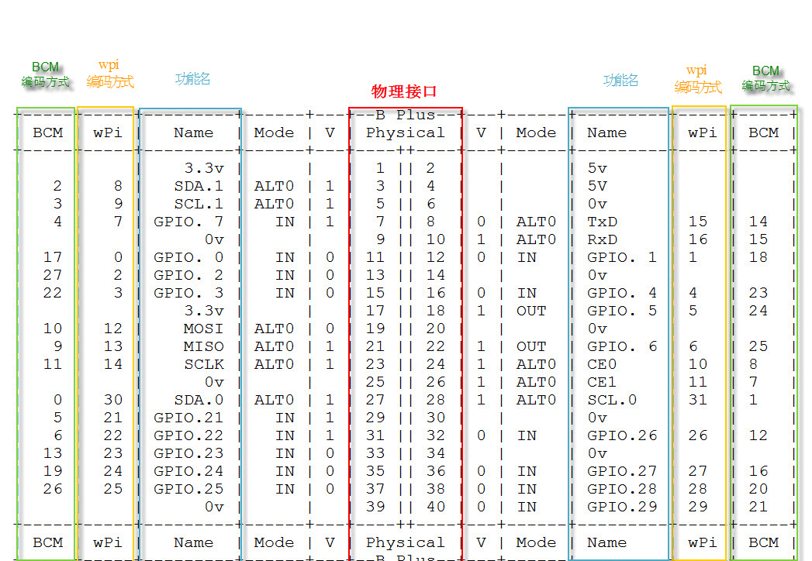
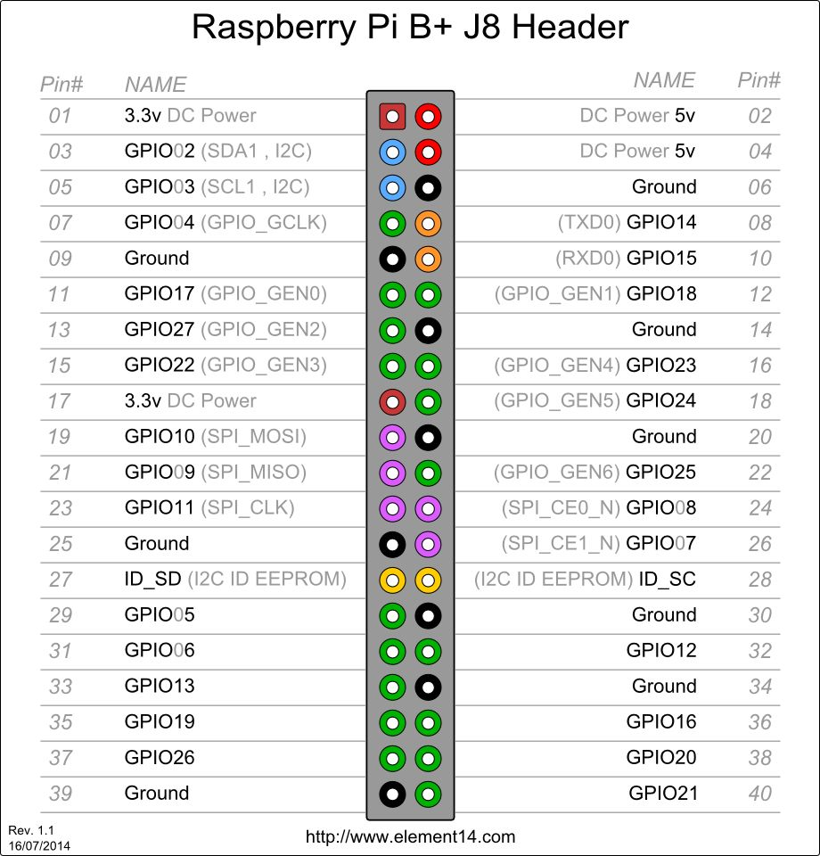

## Part 1

### Raspberry Pi GPIO Numbering Methods and Pin Explanation

Reference: [Raspberry Pi Development Tutorial 9 - Raspberry Pi GPIO Control](http://blog.csdn.net/xdw1985829/article/details/39580401/)

1. **Physical Pin Numbering**  
From left to right, from top to bottom. Odd numbers on the left, even numbers on the right. Total 1-40 pins.

2. **BCM (Broadcom)**  
Numbering according to the GPIO register of BCM2835.

3. **WiringPi (wpi)**  
Logical numbering starting from 0, which is convenient for programming.





### RPi.GPIO

Official page: [pypi.python.org](https://pypi.python.org/pypi/RPi.GPIO)  
SourceForge: [raspberry-gpio-python](https://sourceforge.net/p/raspberry-gpio-python/wiki/Home/)

A simple Chinese example: [Python GPIO Example](http://blog.csdn.net/xukai871105/article/details/12684617#t3)

**RPi.GPIO uses physical pin numbering.**

If it can be written in Python, avoid writing it in C. Python is simply more convenient.

For connecting sensors to Raspberry Pi:  
Vcc to 3.3V or 5V  
GND to Ground  
DATA/OUT or similar to any available GPIO pin.

## Part 2

### DHT11 Temperature and Humidity Sensor

Before using, read the DHT11 datasheet.

[DHT11 Datasheet (Chinese)](http://wenku.baidu.com/link?url=TCTUjZH1BjxjaBC1D-R2_M3DBIMCobdojAzc-8wrisn7A_oKkBVJRTBQxtClI4Q1elePFf_PKU2ZWg7SJTj8mfu3JcKtaaM7GFMx7eJYH_K)

After understanding how to use it, you’ll need to create delays using simple statements like `i=1`, `k+=1`, etc. The delays depend on Raspberry Pi’s CPU and frequency, so testing is required.

**PS: This sensor is quite inaccurate.**

#### Test Delay Code

The following code measures delays of certain statements, showing that `time.sleep` is not reliable at this scale.

```python
import time

a = time.time()
i = 1
c = time.time()
d = c - a
print "Delay of i=1:", d  # 4-7μs
k = 0
a = time.time()
k += 1
c = time.time()
d = c - a
print "Delay of k+=1:", d  # 4-7μs
a = time.time()
time.sleep(0.000001)  # =1μs
c = time.time()
d = c - a
print "Delay of time.sleep(0.000001):", d  # 200-234μs
````

#### DHT11 Example Code

I can't recall where I found this. Ensure GPIO numbers match.

```python
# -*- coding: utf-8 -*-
"""
Created on Sun Jan 26 16:01:59 2014
 
@author: pi
"""

import RPi.GPIO as gpio
gpio.setwarnings(False)
gpio.setmode(gpio.BOARD)
retry_times = 0
def getdata():
    global retry_times
    data = []
    j = 0
    time.sleep(1)
    gpio_number = 7
    gpio.setup(gpio_number, gpio.OUT)
    gpio.output(gpio_number, gpio.LOW)
    time.sleep(0.1) 
    gpio.output(gpio_number, gpio.HIGH)
    i = 1
    i = 1
    i = 1
    i = 1
    gpio.setup(gpio_number, gpio.IN)
    while gpio.input(gpio_number) == 1:
        continue
    while gpio.input(gpio_number) == 0:
        continue
    while gpio.input(gpio_number) == 1:
        continue
    while j < 40:
        k = 0
        while gpio.input(gpio_number) == 0:
            continue
        while gpio.input(gpio_number) == 1:
            k += 1
            if k > 20: break
        if k < 15:
            data.append(0)
        else:
            data.append(1)
        j += 1
    humidity_bit = data[0:8]
    humidity_point_bit = data[8:16]
    temperature_bit = data[16:24]
    temperature_point_bit = data[24:32]
    check_bit = data[32:40]
    humidity = 0
    humidity_point = 0
    temperature = 0
    temperature_point = 0
    check = 0
    for i in range(8):
        humidity += humidity_bit[i] * 2**(7 - i)
        humidity_point += humidity_point_bit[i] * 2**(7 - i)
        temperature += temperature_bit[i] * 2**(7 - i)
        temperature_point += temperature_point_bit[i] * 2**(7 - i)
        check += check_bit[i] * 2**(7 - i)
    tmp = humidity + humidity_point + temperature + temperature_point
    if check == tmp:
        print "temperature is", temperature, "humidity is", humidity, "%"
        return 0
    else:
        print "Error in data:", humidity, humidity_point, temperature, temperature_point, check
        if retry_times == 5:
            print 'error'
            return 1
        retry_times += 1
        getdata()
        
getdata()
```

#### DHT11 + Yeelink Integration

My own code to get data from DHT11 and upload to Yeelink. Ensure GPIO numbers match.

My data: [CHN-Lee-Yumi Raspberry Pi](http://www.yeelink.net/devices/340670)

```python
# encoding: utf-8
import os
import requests
import time
import json
import RPi.GPIO as gpio
gpio.setwarnings(False)
gpio.setmode(gpio.BOARD)

apikey = 'Your Yeelink API key'
def dht11getdata(gpio_number):
    retry_times = 0
    while retry_times <= 5:
        data = []
        j = 0
        time.sleep(1)
        gpio.setup(gpio_number, gpio.OUT)
        gpio.output(gpio_number, gpio.LOW)
        time.sleep(0.1)
        gpio.output(gpio_number, gpio.HIGH)
        i = 1
        i = 1
        i = 1
        gpio.setup(gpio_number, gpio.IN)
        k = 0
        while gpio.input(gpio_number) == 1:
            k += 1
            if k == 20: break
        k = 0 
        while gpio.input(gpio_number) == 0:
            k += 1
            if k == 20: break
        k = 0
        while gpio.input(gpio_number) == 1:
            k += 1
            if k == 20: break
        while j < 40:
            k = 0
            while gpio.input(gpio_number) == 0:
                k += 1
                if k == 20: break
            k = 0
            while gpio.input(gpio_number) == 1:
                k += 1
                if k == 30: break
            if k < 10:
                data.append(0)
            else:
                data.append(1)
            j += 1
        humidity_bit = data[0:8]
        humidity_point_bit = data[8:16]
        temperature_bit = data[16:24]
        temperature_point_bit = data[24:32]
        check_bit = data[32:40]
        humidity = 0
        humidity_point = 0
        temperature = 0
        temperature_point = 0
        check = 0
        for i in range(8):
            humidity += humidity_bit[i] * 2**(7 - i)
            humidity_point += humidity_point_bit[i] * 2**(7 - i)
            temperature += temperature_bit[i] * 2**(7 - i)
            temperature_point += temperature_point_bit[i] * 2**(7 - i)
            check += check_bit[i] * 2**(7 - i)
        tmp = humidity + humidity_point + temperature + temperature_point
        if check == tmp and temperature != 0 and humidity != 0:
            return str(temperature) + ',' + str(humidity)
        else:
            retry_times += 1
            
def uploaddata():
    is_correct = False
    while is_correct == False:
        timestamp = time.strftime("%Y-%m-%dT%H:%M:%S")
        dht11 = dht11getdata(5)
        print 'dht11:', dht11
        dht11_temperature = dht11.split(',')[0]
        dht11_humidity = dht11.split(',')[1]
        dht11_temperature_old = json.loads(requests.get("http://api.yeelink.net/v1.0/device/340670/sensor/393447/datapoints").text)["value"]
        dht11_humidity_old = json.loads(requests.get("http://api.yeelink.net/v1.0/device/340670/sensor/393448/datapoints").text)["value"]
        is_correct = (abs(int(dht11_temperature) - int(dht11_temperature_old)) <= 2 and abs(int(dht11_humidity) - int(dht11_humidity_old)) <= 6)
    json_temperature = '{"timestamp":"'+timestamp+'","value":'+dht11_temperature+'}'
    print json_temperature
    print requests.post("http://api.yeelink.net/v1.0/device/340670/sensor/393447/datapoints",data=json_temperature,headers={'U-ApiKey': apikey})
    json_humidity = '{"timestamp":"'+timestamp+'","value":'+dht11_humidity+'}'
    print json_humidity
    print requests.post("http://api.yeelink.net/v1.0/device/340670/sensor/393448/datapoints",data=json_humidity,headers={'U-ApiKey': apikey})

if __name__ == '__main__':
    try:
        uploaddata()
    except:
        pass
```

### HC-SR501 PIR Motion Sensor

As usual, read the datasheet first.

[HC-SR501 Datasheet (Chinese)](http://wenku.baidu.com/link?url=voT3LvZEGVQG3LS2ZonaeULItwRrgd1decMNelgFahWz2r3xj1M6kgca6wqTTubvDrKcBI-onqDQIc7t_tFLeIDF2r7JZGSxeZ4vszxMqhG)

Simply outputs **high** when motion is detected, **low** when no motion.

#### Logic

1. Loop to check signal.
2. If high, send "motion detected" message.

#### Example Code

My own simple code. Double-check your wiring. 5V power supply, correct polarity.

```python
# encoding: utf-8
import RPi.GPIO as gpio
import time

gpio.setwarnings(False)
gpio.setmode(gpio.BOARD)

gpio_number = 8
gpio.setup(gpio_number, gpio.IN)

while 1:
    if gpio.input(gpio_number) == 1:
        print("+++++++++++++++++")
    else:
        print("------")
    time.sleep(0.1)
```

### HC-SR04 Ultrasonic Distance Sensor

As usual, read the datasheet.

[HC-SR04 Datasheet (Chinese)](http://wenku.baidu.com/link?url=jpCRkaNKQ9v-rYwmKXlaJwvKBpLj0dvw8tN9ovUp_sVwZ6k97uKLY_BN4oE0P40ifauzSO7qmGlSVl0WVEp1wh6f55T5S5MwHLYhqQJ3hn3)

Reference: [HC-SR04 Simple Tutorial](http://bbs.elecfans.com/forum.php?mod=viewthread&tid=451330)

**PS:** Measured range is 0.04-30m. If no signal is received for a long time, it returns 30m.

#### Logic

1. Send a pulse longer than 10μs to the trigger pin.
2. Monitor echo pin for rising edge (start timing).
3. Monitor echo pin for falling edge (end timing).
4. Calculate distance from time difference and sound speed.

#### Example Code

My own simple code. 5V power supply. Double-check your wiring.

```python
# encoding: utf-8
import RPi.GPIO as gpio
import time

gpio.setwarnings(False)
gpio.setmode(gpio.BOARD)

gpio_trig = 10
gpio_echo = 12
gpio.setup(gpio_trig, gpio.OUT)
gpio.output(gpio_trig, gpio.LOW)
gpio.setup(gpio_echo, gpio.IN)

for times in range(1, 6):
    gpio.output(gpio_trig, gpio.HIGH)
    i = 1
    i = 1
    i = 1
    gpio.output(gpio_trig, gpio.LOW)
    while gpio.input(gpio_echo) == 0:
        continue
    t1 = time.time()
    while gpio.input(gpio_echo) == 1:
        continue
    t2 = time.time()
    distance = (t2 - t1) * 340 / 2
    print(distance)
    time.sleep(0.1)
```