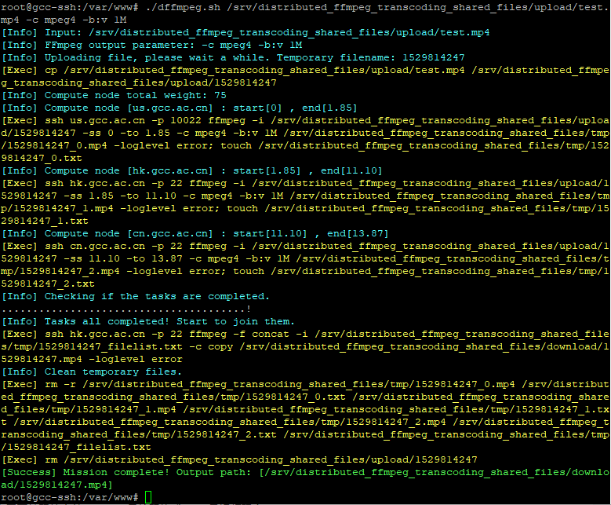

The code has been uploaded to GitHub. Project link: [https://github.com/chn-lee-yumi/distributed_ffmpeg_transcoding_cluster](https://github.com/chn-lee-yumi/distributed_ffmpeg_transcoding_cluster)

## Concept

- A distributed video transcoding cluster based on FFmpeg.
- Current goal: Convert any video format to MP4.
- Architecture includes 1 control node and 3 compute nodes.
- For storage, a single-node NFS shared storage is used for now, with potential for distributed storage in the future.
- CPU architecture is currently not restricted — tested on x86, with plans to support ARM.
- Communication between control and compute nodes is via SSH.
- Workflow: The control node receives the task, uploads the file to shared storage, calculates total video frames, distributes the task to compute nodes (based on manually assigned weights), and each node processes a continuous segment of the video. The final result is merged and cleaned by the storage node. The control node then returns the download link for the transcoded file.

## Installation & Configuration

### Test Environment

- Three public VPS: `cn.gcc.ac.cn`, `hk.gcc.ac.cn`, `us.gcc.ac.cn`
- Storage Node: `hk.gcc.ac.cn`
- Control Node: `cn.gcc.ac.cn`
- Compute Nodes: `cn.gcc.ac.cn`, `hk.gcc.ac.cn`, `us.gcc.ac.cn`

### Storage Node

System: Debian

```bash
# Install NFS
apt-get install nfs-kernel-server

# Create shared directories
mkdir -p /srv/distributed_ffmpeg_transcoding_shared_files
mkdir /srv/distributed_ffmpeg_transcoding_shared_files/upload
mkdir /srv/distributed_ffmpeg_transcoding_shared_files/tmp
mkdir /srv/distributed_ffmpeg_transcoding_shared_files/download
chmod -R 777 /srv/distributed_ffmpeg_transcoding_shared_files
````

Edit `/etc/exports` to share directories via NFS:

* `upload`: Read-write for control node, read-only for compute nodes.
* `tmp`: Read-write for compute nodes.
* `download`: Not shared (local to storage node).

```bash
/srv/distributed_ffmpeg_transcoding_shared_files/upload cn.gcc.ac.cn(ro,insecure) us.gcc.ac.cn(ro,insecure)
/srv/distributed_ffmpeg_transcoding_shared_files/tmp cn.gcc.ac.cn(rw,insecure) us.gcc.ac.cn(rw,insecure)
```

> ⚠️ **Important:** Use the `insecure` option, otherwise mounting will fail with "access denied".

Apply changes:

```bash
exportfs -arv
showmount -e
```

### Compute Nodes

```bash
# Create mount points
mkdir -p /srv/distributed_ffmpeg_transcoding_shared_files/upload
mkdir -p /srv/distributed_ffmpeg_transcoding_shared_files/tmp

# Mount NFS shares (temporary)
mount hk.gcc.ac.cn:/srv/distributed_ffmpeg_transcoding_shared_files/upload /srv/distributed_ffmpeg_transcoding_shared_files/upload
mount hk.gcc.ac.cn:/srv/distributed_ffmpeg_transcoding_shared_files/tmp /srv/distributed_ffmpeg_transcoding_shared_files/tmp

# Install FFmpeg
apt-get install ffmpeg
```

> Note: On Debian Jessie, add `deb http://ftp.debian.org/debian jessie-backports main` to your `sources.list`.

### Control Node

```bash
# Generate SSH key and copy to compute nodes
ssh-keygen -t rsa
ssh-copy-id -i ~/.ssh/id_rsa.pub hk.gcc.ac.cn
ssh-copy-id -i ~/.ssh/id_rsa.pub us.gcc.ac.cn -p 10022

# Mount upload directory
mkdir -p /srv/distributed_ffmpeg_transcoding_shared_files/upload
mount hk.gcc.ac.cn:/srv/distributed_ffmpeg_transcoding_shared_files/upload /srv/distributed_ffmpeg_transcoding_shared_files/upload
```

Save the following script (e.g. `dffmpeg.sh`) and make it executable:

👉 *Script omitted here for brevity. It's the same as in the original post.*
[Refer to GitHub repository for full script](https://github.com/chn-lee-yumi/distributed_ffmpeg_transcoding_cluster)

## Usage & Testing

* Run the script from the control node:

```bash
dffmpeg.sh test.mp4 -c mpeg4 -b:v 1M
```

* `test.mp4` is the input file.
* `-c mpeg4` specifies codec, `-b:v 1M` sets video bitrate.
* The final `.mp4` file will appear in the `download` directory.
* Note: Since the servers are located in different geographic regions, the bottleneck is the read/write speed of NFS. If compute nodes cache the video locally, the speed is significantly better than single-node transcoding.

### Sample Output



## Final Thoughts

* This was a fun project. Originally, I planned to test this using Raspberry Pi devices, but only had one available, so I used VPS instances instead.
* There's a commented-out line: `for i in {0..${#compute_node[*]}}`. This doesn’t work in Bash due to how variable expansion interacts with brace expansion. I replaced it with a classic C-style for loop.
* The "task completion check" section could be written more elegantly — suggestions are welcome.

## Changelog

* **v1.1:** Fixed issue where final video was longer than original. Caused by placement of `-ss` flag.
* **v1.2:** Added support for FFmpeg output parameters and colourful logs.
