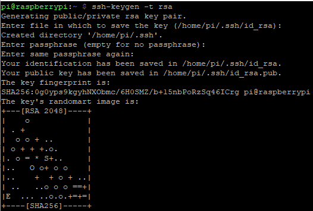
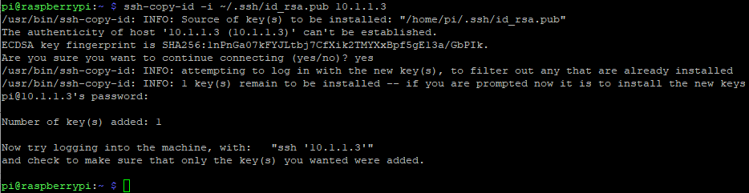
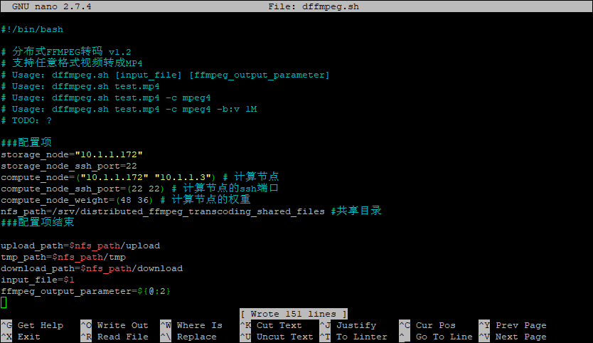
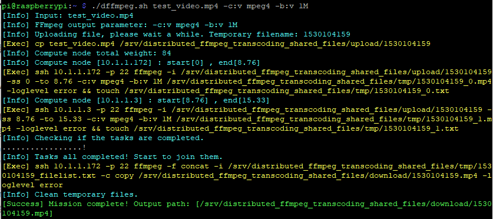

## Introduction

- For more information about distributed FFMPEG transcoding, please refer to my earlier blog: https://blog.csdn.net/imdyf/article/details/80621009  
- Source code is available on GitHub: https://github.com/chn-lee-yumi/distributed_ffmpeg_transcoding_cluster  
- In fact, the cluster can consist of CPUs with different architectures. You can use several Raspberry Pis along with some x86 PCs; they can work together. We’ll discuss this at the end of the article.
- We’ll start by building a cluster using only Raspberry Pis. I used a Raspberry Pi 2B and a Raspberry Pi 3B. My computer runs Windows 10, which is used to flash the OS and configure the Raspberry Pis.
- There are three types of cluster node roles: controller (one), compute (at least one), and storage (one). Each node can serve one or more roles. Our role assignment is as follows:

| Node        | Role(s)                  |
|-------------|--------------------------|
| Raspberry Pi 3B | Controller, Compute, Storage |
| Raspberry Pi 2B | Compute                 |

## Preparation

- First, download the latest Raspberry Pi image from raspberrypi.org. I used Raspbian. Then flash it to a TF card using Win32DiskImager. After flashing, create an empty file named `ssh` in the boot partition. You can now boot up the Raspberry Pi.
- After booting, find the IP address of the Pi via your router's admin page. Then use PuTTY to connect via SSH. Default username is `pi` and password is `raspberry`.
- My Raspberry Pi 2B has IP: `10.1.1.3`; the 3B has IP: `10.1.1.172`.
- **No matter the node, always perform this step first:**
- Switch to a local (China) software source. I used Tsinghua University's mirror. Follow the instructions here: https://mirrors.tuna.tsinghua.edu.cn/help/raspbian/ and run:

```shell
sudo nano /etc/apt/sources.list
````

Replace the contents with:

```
deb http://mirrors.tuna.tsinghua.edu.cn/raspbian/raspbian/ stretch main non-free contrib
deb-src http://mirrors.tuna.tsinghua.edu.cn/raspbian/raspbian/ stretch main non-free contrib
```

* Press `Ctrl+O` to save, then `Ctrl+X` to exit.
* Run `sudo apt-get update` to update sources.

### Raspberry Pi 3B Configuration

#### Storage Setup

* Shared storage is essential in this cluster. Let’s set it up:

```shell
sudo apt-get install nfs-kernel-server
sudo chmod 777 /var/lib/nfs/.etab.lock
sudo chmod 777 /var/lib/nfs
sudo mkdir -p /srv/distributed_ffmpeg_transcoding_shared_files
sudo chmod 777 /srv/distributed_ffmpeg_transcoding_shared_files
mkdir /srv/distributed_ffmpeg_transcoding_shared_files/upload
mkdir /srv/distributed_ffmpeg_transcoding_shared_files/tmp
mkdir /srv/distributed_ffmpeg_transcoding_shared_files/download
```

* Edit the exports file:

```shell
sudo nano /etc/exports
```

Replace its contents with:

```
/srv/distributed_ffmpeg_transcoding_shared_files/upload 10.1.1.3(ro,insecure)
/srv/distributed_ffmpeg_transcoding_shared_files/tmp 10.1.1.3(rw,insecure)
```

* If you have three compute nodes (10.1.1.3–10.1.1.5), update the lines as follows:

```
/srv/distributed_ffmpeg_transcoding_shared_files/upload 10.1.1.3(ro,insecure) 10.1.1.4(ro,insecure) 10.1.1.5(ro,insecure)
/srv/distributed_ffmpeg_transcoding_shared_files/tmp 10.1.1.3(rw,insecure) 10.1.1.4(rw,insecure) 10.1.1.5(rw,insecure)
```

* If the storage node is also a compute node, it doesn’t need to mount the NFS.
* Run the following to apply changes:

```shell
exportfs -arv
```

#### Compute Setup

* Very simple: just install FFMPEG:

```shell
sudo apt-get install ffmpeg
```

#### Controller Setup

* First, set up passwordless SSH. Run:

```shell
ssh-keygen -t rsa
```



Just press Enter through all prompts.

* Then copy the public key to the Raspberry Pi 2B (IP: `10.1.1.3`):

```shell
ssh-copy-id -i ~/.ssh/id_rsa.pub 10.1.1.3
```



Type `yes` when prompted, then enter the password `raspberry`.

* Also copy the key to the Raspberry Pi 3B itself (since it's also a compute node):

```shell
ssh-copy-id -i ~/.ssh/id_rsa.pub 10.1.1.172
```

Repeat for any additional compute nodes.

* Now download the control script:

```shell
wget https://raw.githubusercontent.com/chn-lee-yumi/distributed_ffmpeg_transcoding_cluster/master/dffmpeg.sh
chmod +x dffmpeg.sh
```

* Open and modify configuration:

```shell
nano dffmpeg.sh
```

Modify the following:



(Assign higher weights to more powerful nodes.)

* Finally, install `bc`:

```shell
sudo apt-get install bc
```

### Raspberry Pi 2B Configuration

* This node is only a compute node. Install FFMPEG and mount shared storage:

```shell
sudo apt-get install ffmpeg
sudo mkdir -p /srv/distributed_ffmpeg_transcoding_shared_files
sudo chmod 777 /srv/distributed_ffmpeg_transcoding_shared_files
mkdir /srv/distributed_ffmpeg_transcoding_shared_files/upload
mkdir /srv/distributed_ffmpeg_transcoding_shared_files/tmp
sudo mount 10.1.1.172:/srv/distributed_ffmpeg_transcoding_shared_files/upload /srv/distributed_ffmpeg_transcoding_shared_files/upload
sudo mount 10.1.1.172:/srv/distributed_ffmpeg_transcoding_shared_files/tmp /srv/distributed_ffmpeg_transcoding_shared_files/tmp
```

(10.1.1.172 is the IP of the storage node, which is the Raspberry Pi 3B.)

## Testing

* Testing is done on the controller. Download a test video:

```shell
wget https://github.com/chn-lee-yumi/distributed_ffmpeg_transcoding_cluster/blob/master/test_video.mp4?raw=true
```

* Rename the file:

```shell
mv test_video.mp4?raw=true test_video.mp4
```

* Then run the transcoding test:

```shell
./dffmpeg.sh test_video.mp4 -c:v mpeg4 -b:v 1M
```

This converts `test_video.mp4` to MPEG-4 format with a 1 Mbps video bitrate.



## Conclusion

* We encountered a strange bug: `ffmpeg` was still running, yet the script continued and executed the `touch` command, which led to errors in final video merging. A temporary workaround is to increase the `sync_wait_time` in the control script. The root cause is unknown, but it's not related to NFS usage, since the issue also occurs on nodes not using NFS. This remains to be fixed.
* x86 machines can also be added to the cluster. Just install FFMPEG, set up passwordless SSH, mount the shared storage, and add them to the control script.
