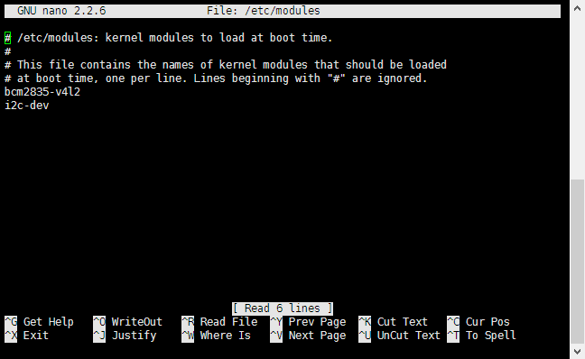
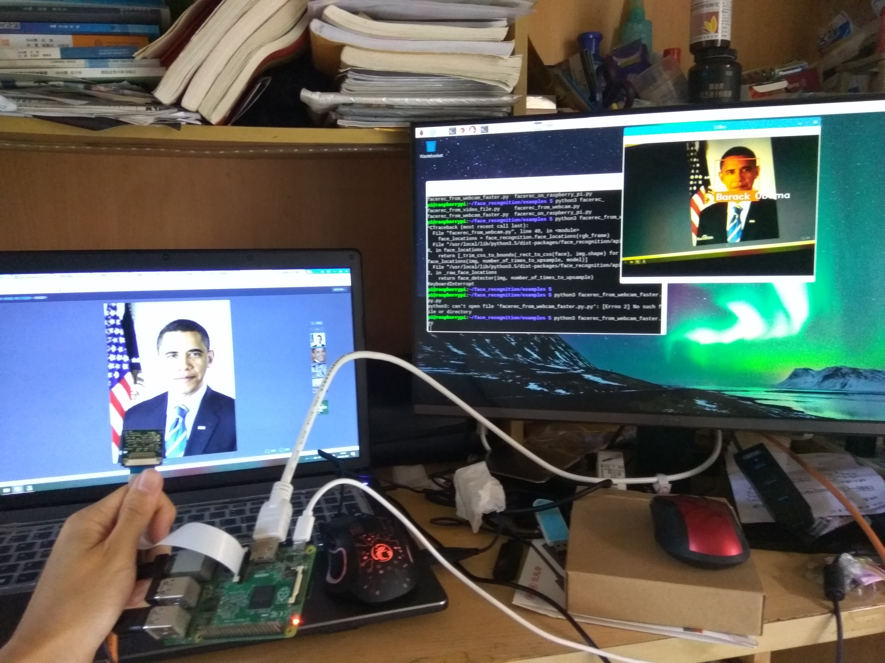
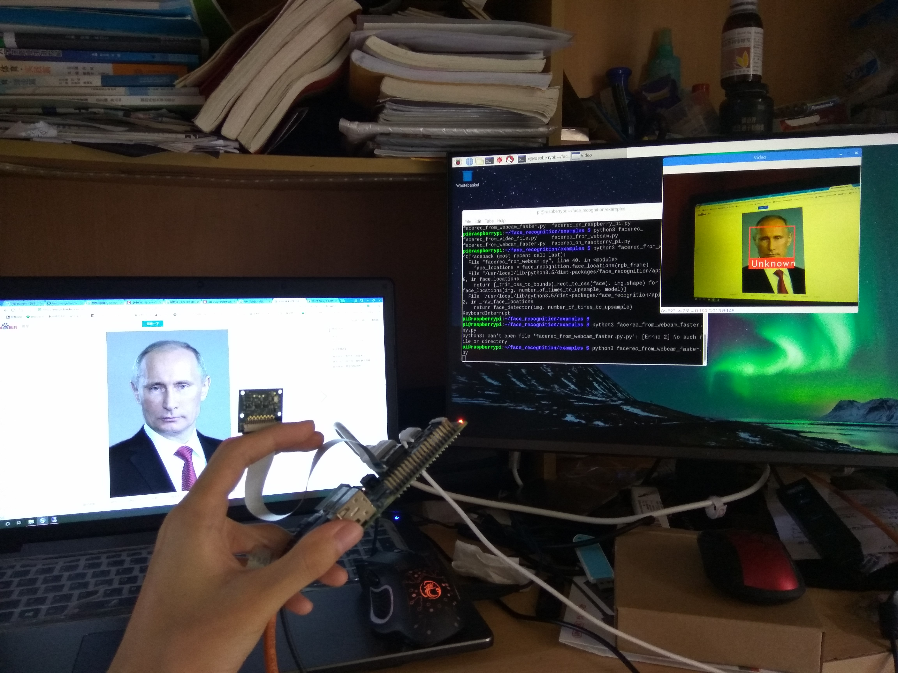

## Real-Time Face Recognition on Raspberry Pi

Recently, I've been experimenting with [face_recognition](https://github.com/ageitgey/face_recognition), a Python-based face recognition library. The author demonstrated real-time face recognition using a webcam on a desktop, as shown in the following example:


I wanted to replicate this effect on a Raspberry Pi. If embedded devices can achieve this, it would be amazing—just like something from a movie.

## Installation Steps

You can follow the installation guide from the project page: [Raspberry Pi 2+ installation instructions](https://gist.github.com/ageitgey/1ac8dbe8572f3f533df6269dab35df65). I'm using a Raspberry Pi 2B with a quad-core 900MHz CPU and 1GB RAM (though `face_recognition` only uses one core). I've overclocked the CPU to 1050MHz. (For details about overclocking, check out my blog post: [Performance and Power Consumption of Overclocked Raspberry Pi](https://blog.csdn.net/imdyf/article/details/52172170))

Below are the steps I followed. (I won’t cover how to install the system itself—there are plenty of tutorials online. Make sure to change your apt sources; I used USTC's mirror as I’m in a university network.)

First, install a bunch of required libraries:

```shell
sudo apt-get update
sudo apt-get install build-essential \
    cmake \
    gfortran \
    git \
    wget \
    curl \
    graphicsmagick \
    libgraphicsmagick1-dev \
    libatlas-dev \
    libavcodec-dev \
    libavformat-dev \
    libboost-all-dev \
    libgtk2.0-dev \
    libjpeg-dev \
    liblapack-dev \
    libswscale-dev \
    pkg-config \
    python3-dev \
    python3-numpy \
    python3-pip \
    zip
````

If you're using the Raspberry Pi camera module (CSI interface), run the following:

```shell
sudo apt-get install python3-picamera
sudo pip3 install --upgrade picamera[array]
```

Download and install dlib:

```shell
mkdir -p dlib
git clone -b 'v19.6' --single-branch https://github.com/davisking/dlib.git dlib/
cd ./dlib
sudo python3 setup.py install --compiler-flags "-mfpu=neon"
```

Install `face_recognition`:

```shell
sudo pip3 install face_recognition
```

Clone the example code and try running it:

```shell
git clone --single-branch https://github.com/ageitgey/face_recognition.git
cd ./face_recognition/examples
python3 facerec_on_raspberry_pi.py
```

At this point, I encountered an error about a missing library. Normally, we can search for the package name with `apt-cache search <library_name>` and then install it using `sudo apt-get install <package_name>`.

The error mentioned a missing `libatlas.so.3`. After running `apt-cache search libatlas`, I found that the package name is `libatlas3-base`, so I installed it with:

```shell
sudo apt-get install libatlas3-base
```

You'll encounter similar issues when testing the camera, and the solution is the same.

After installation, the code ran successfully.

Our goal is **real-time face recognition on the Raspberry Pi**, so I connected the camera module (CSI interface), enabled the camera in `raspi-config`, and rebooted. (If you're unfamiliar, search for "how to use Raspberry Pi camera module".)

Then, I ran the real-time face recognition code:

```shell
python3 facerec_from_webcam_faster.py
```

An error occurred during `import cv2`, complaining about missing libraries. Just follow the instructions and install the missing libraries. You may need to go through a few rounds of installing missing dependencies before everything works.

Next, the program threw another error at this line:
`small_frame = cv2.resize(frame, (0, 0), fx=0.25, fy=0.25)`
This happened because `video_capture.read()` failed to grab a frame. But the camera was connected, so why was it not reading properly? Was the camera broken? No.

> This is because the Raspberry Pi camera module is loaded as firmware under `/boot/`, and not as a standard V4L2 camera driver. Therefore, `/dev/video0` does not exist.
> [Source: Using CSI Camera in OpenCV on Raspberry Pi](https://blog.csdn.net/deiki/article/details/71123947)

To resolve this, load the V4L2 driver module manually:

```shell
sudo modprobe bcm2835-v4l2
```

To load it automatically on boot, edit `/etc/modules` and add:

```
bcm2835-v4l2
```

As shown below:



Now run the code again:

```shell
python3 facerec_from_webcam_faster.py
```

This time it works! A video window appears showing the camera feed. Here's what my test looked like:




