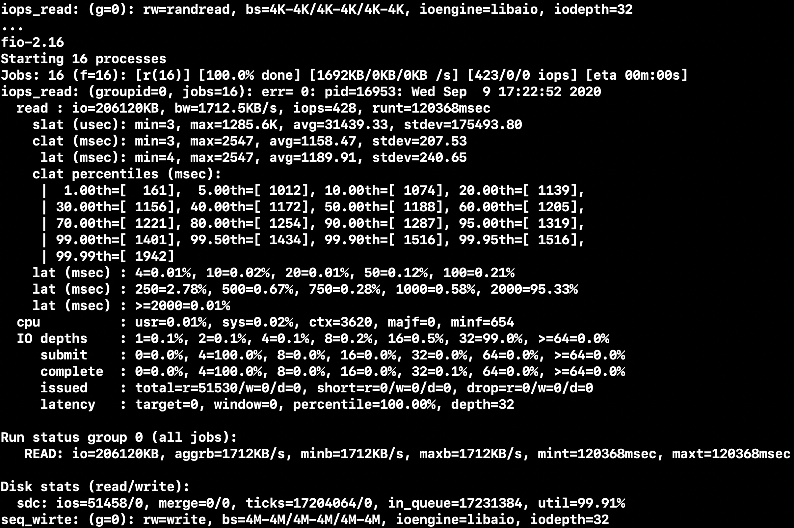
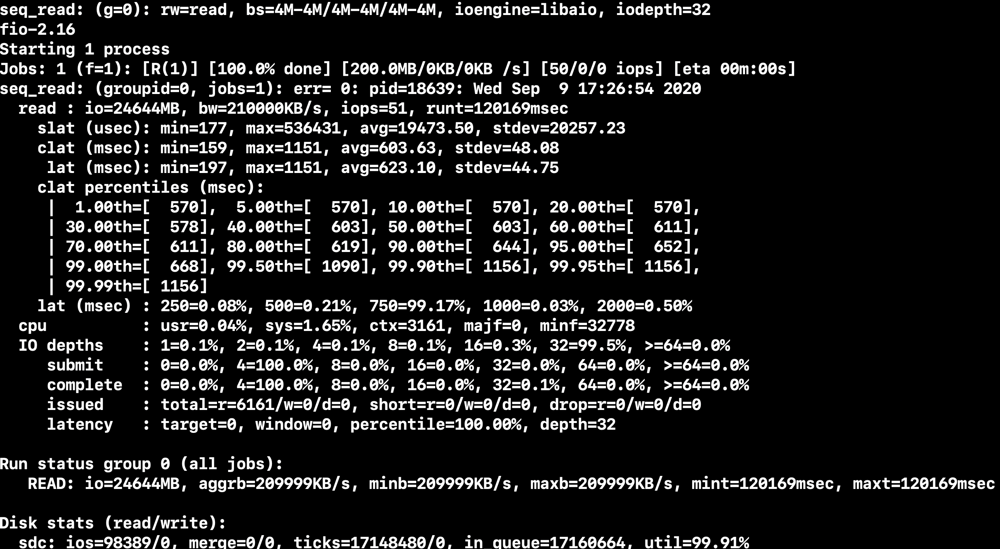

> **RAID 0 is fast—but it’s a data graveyard when a single disk fails.**  
> In this post, we explore the real-world performance of 24 enterprise-grade SAS hard drives in a RAID 0 array, using the `fio` benchmark tool on a Dell PowerEdge R730xd server.

---

## What is RAID?

**RAID** stands for *Redundant Arrays of Independent Disks*. It’s a data storage virtualisation technology that combines multiple physical drives into one logical unit to improve performance, reliability, or both.

Common RAID levels include:

- **RAID 0** – Striping only. Maximises performance, but offers no redundancy. If a single disk fails, all data is lost.
- **RAID 1** – Mirroring. Every disk holds the same data. Good redundancy, read performance improves, write performance stays similar to a single disk.
- **RAID 5** – Striping with parity. Needs at least 3 disks. Offers fault tolerance with decent performance.
- **RAID 6** – Similar to RAID 5, but with double parity. Can tolerate 2 disk failures. Requires at least 4 disks.
- **RAID 10** – A combination of RAID 1 and RAID 0. Offers both high performance and redundancy.

This post focuses on **RAID 0**, which maximises speed but provides no data protection—hence the saying:

> **“RAID 0 is fast, but it's a data crematorium.”**

---

## Test Setup

- **Server**: Dell PowerEdge R730xd  
- **RAID Controller**: PERC H330 Mini (hardware RAID)
- **Drives**: 24 × 1.2TB 2.5" SAS enterprise hard drives  
- **Benchmark Tool**: `fio`  
- **Operating System**: Linux

The RAID 0 array was created using the `megacli` utility. The controller was configured with:

- **Write policy**: `WriteThrough` (writes bypass cache)
- **Read policy**: `ReadAhead` (improves sequential read speed)
- **Direct I/O**: Enabled (uses controller cache to improve read hits)

> The total capacity shown was **26.2TB**, not 28.8TB as one might expect from 24 × 1.2TB drives.  
> Why? Storage vendors use **decimal** units (1TB = 1000^4 bytes), while operating systems use **binary** units (1TB = 1024^4 bytes).  
> So:  
> `1.2 × 1000⁴ ÷ 1024⁴ × 24 ≈ 26.2TB`


---

## Fio Test Script

```bash
filename=fio.test  # originally /dev/sdb
size=100GB

# 4K random write
fio --iodepth=32 --numjobs=16 --size=$size --norandommap \
    --readwrite=randwrite --bs=4K --runtime=120 --filename=$filename \
    --ioengine=libaio --direct=1 --group_reporting --name=iops_write

sync && echo 1 > /proc/sys/vm/drop_caches

# 4K random read
fio --iodepth=32 --numjobs=16 --size=$size --norandommap \
    --readwrite=randread --bs=4K --runtime=120 --filename=$filename \
    --ioengine=libaio --direct=1 --group_reporting --name=iops_read

# Sequential write (4MB blocks)
fio --iodepth=32 --numjobs=1 --size=$size --norandommap \
    --readwrite=write --bs=4M --runtime=120 --filename=$filename \
    --ioengine=libaio --direct=1 --name=seq_write

sync && echo 1 > /proc/sys/vm/drop_caches

# Sequential read (4MB blocks)
fio --iodepth=32 --numjobs=1 --size=$size --norandommap \
    --readwrite=read --bs=4M --runtime=120 --filename=$filename \
    --ioengine=libaio --direct=1 --name=seq_read
````

---

## Single Drive Benchmark

Each 1.2TB SAS drive was first tested individually for baseline performance:

* **4K Random Write**: 343 IOPS
  

* **4K Random Read**: 428 IOPS
  

* **Sequential Write**: 205.8 MB/s
  

* **Sequential Read**: 205.0 MB/s
  

---

## 24-Drive RAID 0 Benchmark

The full 24-disk RAID 0 array was then tested with the same parameters:

* **4K Random Write**: 1192 IOPS
  

* **4K Random Read**: 1236 IOPS
  

* **Sequential Write**: 3689.5 MB/s
  

* **Sequential Read**: 4644.3 MB/s
  

---

## Performance Summary

| Test Type        | Single Drive | RAID 0 (24 Disks) | Gain    |
| ---------------- | ------------ | ----------------- | ------- |
| 4K Random Write  | 343 IOPS     | 1192 IOPS         | \~3.5×  |
| 4K Random Read   | 428 IOPS     | 1236 IOPS         | \~2.9×  |
| Sequential Write | 205.8 MB/s   | 3689.5 MB/s       | \~17.9× |
| Sequential Read  | 205.0 MB/s   | 4644.3 MB/s       | \~22.7× |

---

## Conclusion

This test demonstrates that RAID 0 can offer **incredible throughput**, especially for large, sequential operations. Read speeds above 4.6GB/s and write speeds above 3.6GB/s are impressive, even for 15K RPM enterprise drives.

However, the gains for **random I/O** are far less significant. More importantly, **RAID 0 offers no data redundancy**. If any one of the 24 disks fails, all data in the array is lost.

> **Recommendation**: Use RAID 0 only for temporary data, caches, or situations where speed is paramount and loss is acceptable.

---

**TL;DR**

* RAID 0 with 24 SAS HDDs delivers massive sequential performance.
* Random IOPS scaling is limited by disk mechanics and controller architecture.
* **Never** use RAID 0 for critical data without proper backup.
* As the saying goes:

> **"RAID 0 is fun until someone loses a disk."**
