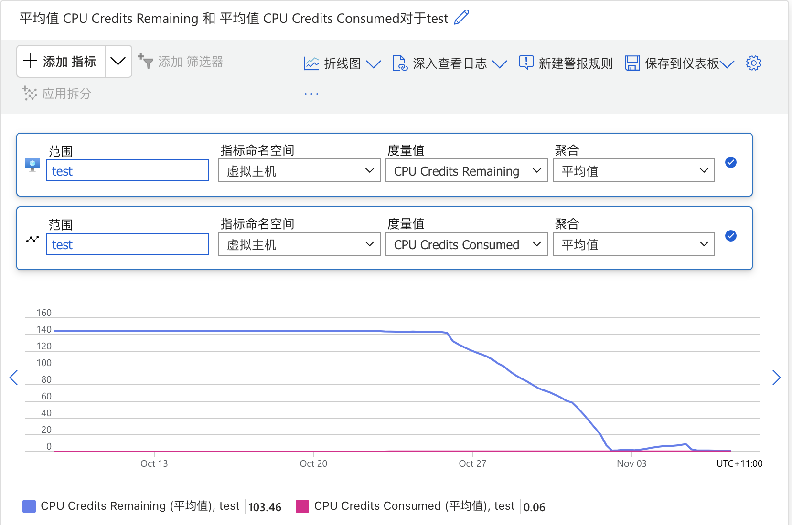

## Introduction

I have a virtual machine on Azure, specifically a B1s instance. Recently, I noticed it became very sluggish. Running the `top` command showed that both `sy` (system CPU) and `si` (soft IRQ) were unusually high:

```text
%Cpu(s): 52.1 us, 21.9 sy,  0.0 ni,  0.0 id,  0.0 wa,  0.0 hi, 26.0 si,  0.0 st
```

## Investigation Process

Since investigating `sy` can be quite complex, I decided to start with the simpler `si`. I used the following command to monitor soft IRQ activity:

```text
           CPU0
  4:    6042775   IO-APIC   4-edge      ttyS0
  8:          0   IO-APIC   8-edge      rtc0
  9:          0   IO-APIC   9-fasteoi   acpi
NMI:          0   Non-maskable interrupts
LOC:          0   Local timer interrupts
SPU:          0   Spurious interrupts
PMI:          0   Performance monitoring interrupts
IWI:          1   IRQ work interrupts
RTR:          0   APIC ICR read retries
RES:          0   Rescheduling interrupts
CAL:          0   Function call interrupts
TLB:          0   TLB shootdowns
HYP:  303764679   Hypervisor callback interrupts
HRE:          0   Hyper-V reenlightenment interrupts
HVS:  826460279   Hyper-V stimer0 interrupts
ERR:          0
MIS:          0
PIN:          0   Posted-interrupt notification event
NPI:          0   Nested posted-interrupt event
PIW:          0   Posted-interrupt wakeup event
```

I observed that `HYP` and `HVS` counters were increasing rapidly. This clearly indicated that the issue was not with my system itself, but with the hypervisor on the host machine.

Given that I hadn’t made any recent changes to the server, I suspected the root cause was that my burstable CPU credits had been exhausted, which in turn slowed down the system.

I logged into the Azure portal and checked the monitoring dashboard, which confirmed that the CPU credits had indeed been used up.



### Solution

Either upgrade the VM size or reduce the server load.
